# Introduction

This document describes the architecture and design of a single page web application that interacts with microservices via RESTful APIs.
The key elements in this document include the architecture, user interface, client components, and server classes.

This is a living document that is updated as changes are made each sprint.
The initial document describes the Base code students are given as a starting point for the semester.
During sprint planning the team will sketch proposed user interface changes, changes to the component hierarchy on the client, and changes to the class diagram on the server for each of the selected Epics.
At the end of the sprint, students should update the document to reflect the action changes made.

# Base

The Base is a simple application to provide the architecture to the students at the beginning of the semester.
The JavaScript code will include useful examples for students to learn from and leverage in the code they write for later sprints.
The progressive display of information using collapsible sections and popups will serve as examples of good user interface design.
The overall design is somewhat minimalist/simple for the intended mobile device audience.

### Architecture

The Base architecture is a JavaScript single page web application in an HTML5 browser that uses RESTful APIs to access Micro-services provided by a Java server running on Linux.
The client consists of a minimal index.html file that loads and executes the bundled JavaScript application.
The client and server files are bundled into a single JAR file for execution on the Linux server at a specified port.
The browser fetches the client HTML and JavaScript files from the server on the specified port.
The client application running in the browser makes Restful API calls for services specified in the protocol.

The browser loads the index.html file (by default) which in turn loads the bundled JavaScript single page application bundle.js.
* The single page application makes RESTful API requests to the server on the same port using  JavaScript's asynchronous fetch.  
* A protocol document describes the JSON format for the RESTful API requests and responses.
* JSON Schemas are used to verify requests on the server side and responses on the client side.
* On the client, ReactJS renders the application using ReactStrap, Leaflet, and application defined components.
* GSON is used on the server to convert JSON requests to Java objects and Java objects to JSON responses.
* The client (ulog) and server (SLF4J) logging mechanisms control debugging output during development and production. 
* Print statements and console logging should never be used directly. 

The following architecture elements are not included in the Base system.
They will be added later in the semester.
* Client filesystem.
* Server SQL.
* Server concurrency.

### User Interface

The basic screen in black shows the view on a mobile device, with a header, footer, and trip.
The header contains a earth logo and the team name obtained from the server when the client was loaded.
The footer contains a connection icon along with the current server name and server URL the client is connected to.
The trip shows a map and the current list of destinations.

Rather than buttons or icons to signify actions, we are associating actions with elements that are already on the screen to reduce the clutter.
We are using both popups and collapsible sections in this design rather than choosing to use one exclusively.

* Collapsible/Hidden sections are used for the map and about sections since they have a significant amount of content and we don't need to see them at the same time.
* A popup is used for the URL change since we want to control the interaction until the operation is completed. It seemed more natural than another collapsible section.

#### Clicking on the team name in the header
Displays an About screen with team information, currently empty.
Hides tha trip information
Clicking again restores the trip information.
The About screen will be completed in Sprint 1.

#### Clicking on the map
Adds to the location to the trip.
* Displays a marker with latitude, longitude, and a description at that location on the map.
* Displays a line on the map showing the order of the destinations in the trip.
* The description is obtained from reverse geocoding.
* Appends the location to the destionations in the trip below the map.

#### Clicking the trip hamburger (&#8942;)
A list of menu options is displayed.
* You can add the current location the to the trip.
* You can add a location specfied by latitude and longitude.
* You can clear the list.

#### Clicking the hamburger (&#8942;) for a destination
A list of menu options is displayed.
* You can remove that destination from the list.

#### Clicking a entry is the trip list
Shows information about that destination.
* The detailed description of the entry will be toggled on or off.
* The map will move the marker to the selected location.

#### Clicking on the URL in the footer.
Show the information about the current server and let's you change the server for interoperability testing.
* When a user clicks on the URL, a popup should open showing the server configuration (team name and features) in an input text box.
* The Cancel button allows the user to exit the popup.
* When the user modifies the URL, the client will attempt to connect to the new server and update the configuration.
* When the client receives a successful response for a URL, it will display a Save button.
* When the user clicks the Save button, the server connection changes and the popup closes, revealing the new servername and URL in the footer.

Component Hierarchy
The component hierarchy for the base application depicted below shows the our top level App component with four children components.

App renders the major components on the screen.
Header renders an icon and a team name in the top banner.
Footer renders the current server connection in the bottom footer.
Planner renders a map.
About renders information about the team.
LoadTrip renders upload modal
SetUnits renders modal to allow user to set units
EditName renders modal to edit trip name
AddPlace renders modal to allow for user to search for and add places to map
OptTrip renders modal to allow for trip optimization
SaveTrip renders modal to allow user to save trip as a JSON
base component hierarchy 

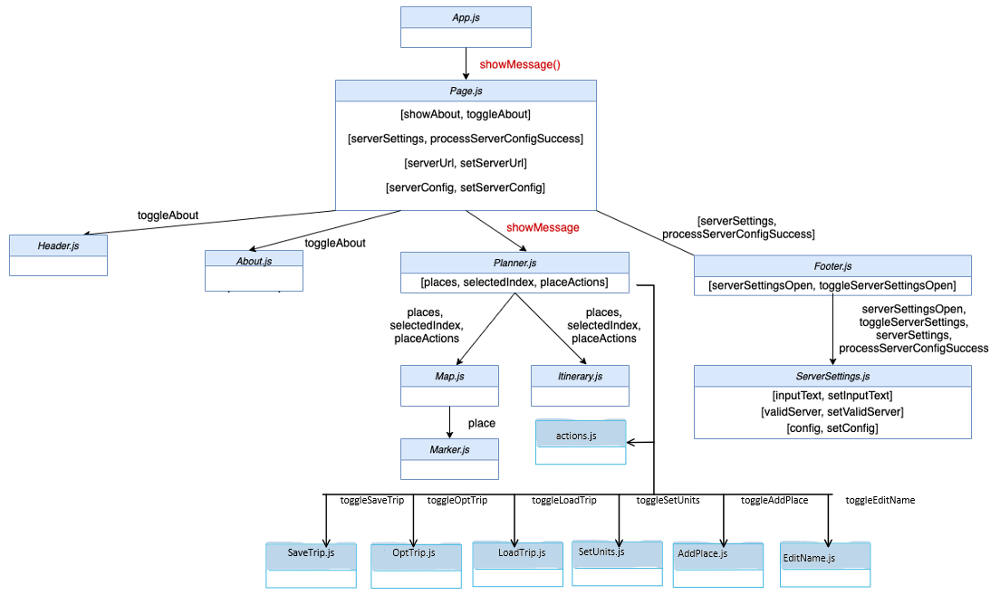

We do not show the many ReactStrap components in this hierarchy, even though they will appear when you are debugging on the client.

### Class Diagram
The class diagram for the base application depicted below shows the basic structure of the web server application.

The classes in blue represent the classes specific to this application.  
* WebApplication processes command line parameters and creates MicroServer.
* MicroServer start a web server on the given port, configures the server for security, static files, and APIs for different types of requests, and processes the requests as they arrive.
* JSONValidator verifies a request is properly formatted before attempting to process it using JSON Schemas.
* ConfigRequest is a specific request that allows the server to respond with its configuration to allow interoperability between clients and servers. 
* Request defines the basic components of all requests.
* BadReqeustException allows us to distinguish bad requests from other types of exceptions that may occur.
* TourRequest allows us to send a request to optimize the current trip
* DistancesRequest allows us to calcualate distances between places
* FindRequest allows us to request a search request from the database
* GreatCircleDistance lets us calucalte the distances based on earth radius
* OptimizeTrip handles the calculations needed to optimize the trip in the TourRequest
* SQLGuide allows us to query the database for FindRequest
  * Database is a subclass of SQLGuide that returns query results
  * Credential is a subclass of SQLGuide that lets us access the database
  * Select is a sublclass of SQLGuide that lets us call the SELECT command
* Place is a class that extends HashMap<String, String> to let us create a Place object
* Places is a class that extends ArrayList<Place> to let us create an arrayList of Place object

  
These test classes provide automated tests for unit testing.
* TestWebApplication
* TestMicroServer
* TestConfigRequest
* TestJSONValidator
* TestGreatCircleDistance
* TestOptimizeTrip
* TestFindRequest
* TestSQLGuide
* TestTourRequest
* TestDistancesRequest

# Sprint 1

In this sprint we focus on two epics.

### Epic: Team identification

#### User Interface
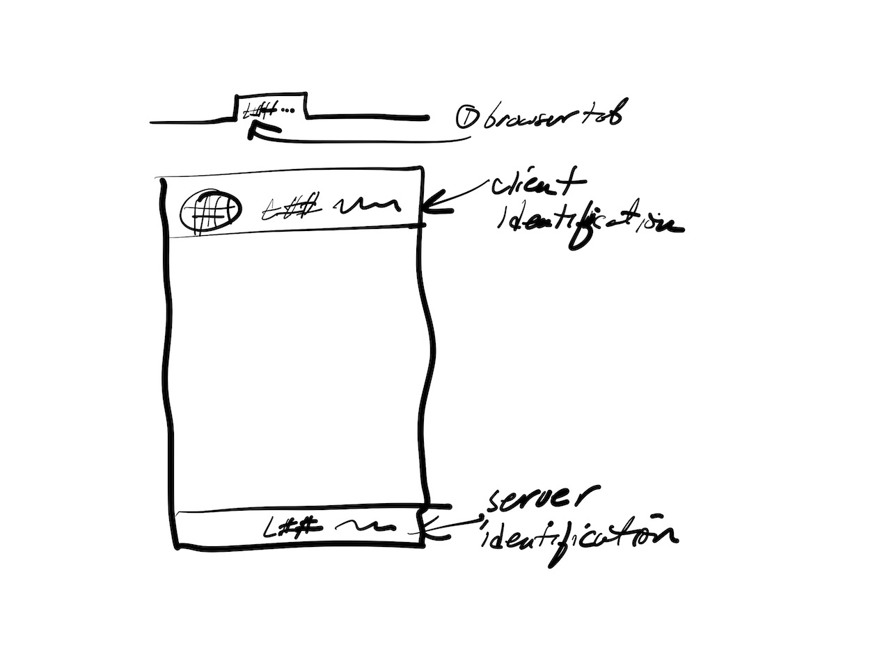

This epic requires the team to the following information to update the team number and name:
* the browser tab contained in the TITLE tag of the HTML document.
* the header information that shows the client information.
* the footer information that shows the server information.  This may be different from the client information when the server is changed for interoperability testing.
  
#### Client Components 
There are no changes to the client component hierarchy for this epic.

Only a constants file needs to be modified.

#### Server Classes
There are no changes to the server class structure for this epic.

Only minor changes to text constants are required in the source and tests are required.

### Epic: About

#### User Interface
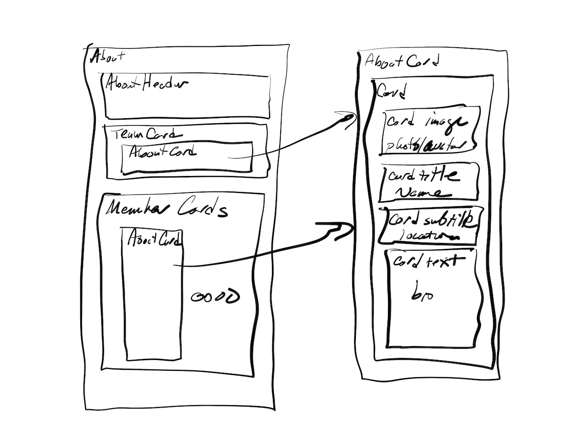

The template about page needs to be completed with:
* Team image
* Team mission statement
* Member name, hometown and bios.
* Member images.

#### Client Components
There are no changes to the client component hierarchy for this epic.  
The necessary components are already defined.

Changes required include:
* Updates to a constants file for the team mission statement.
* Updates to a constants file containing team member name and bio information.
* Addition of image files for the team and each team member. 

#### Server Classes
There are no changes to the server class structure for this epic.

# Sprint 2

In this sprint we focus on three epics.

### Epic: Load Trip

#### User Interface
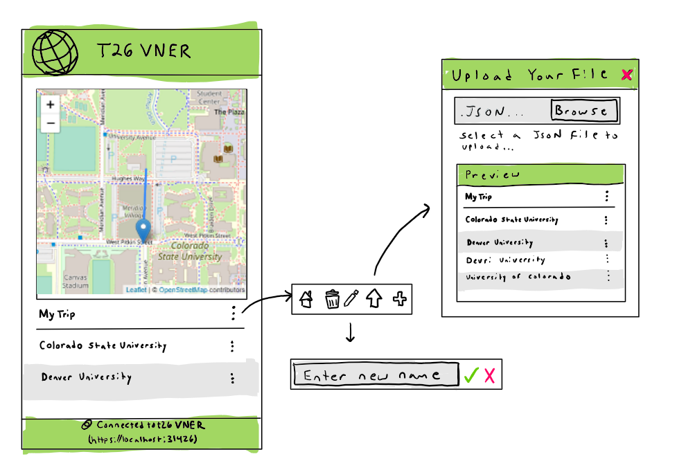

This epic requires the team to implement features to allow the user to load a previously saved map into the application:
* Add a symbol for upload in the hamburger menu.
* When symbol is clicked, generate a pop-up window to process the upload.
* Title the pop-up window "File Upload" or something similiar.
* Add upload button with text nearby stating filetype requirements
* Make uplaod button open a browse system window.
* Read in JSON file and generate the trip (The file format must be compatible with the file specification so trips from other applications may be loaded.)
* Optional: create a preview window.
* Optional: change trip name from the default "my trip" to the file name.
* Optional: allow user to change trip name at any time.
  
#### Client Components 
Client components will be added or altered in this epic. We will be adding buttons to the user interface in the actions.js file as well as adding new functionality to the client in order to provide the user the capability to load a trip.

#### Server Classes
There are no changes to the server class structure for this epic.

### Epic: Interoperability

#### User Interface
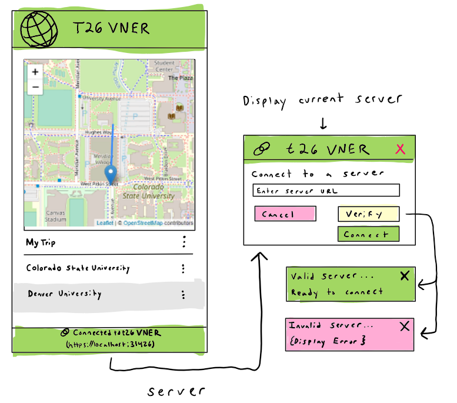

This epic requires our team to implement interoperability between the client and other servers and a verification that necessary features are available.
* Create a button on the bottom banner (where the team name and localhost:portNumber are located) that opens another window (NewWindow1) that displays the current server the client is running on.
* In the NewWindow1, have a text box where the user can enter a server's URL to connect to.
* In the NewWindow1, have a cancel button that returns the user to the previous screen (webservice map screen with previously loaded trip-legs).
* In the NewWindow1, have a verify button where the user can test the server URL they entered in the text box to verify it is a valid, working server.
* In the NewWindow1, have a connect button which uses the server URL typed in the text box to reconnect the client to.
* When the user connects to the new server, check to see if necessary features are implemented and warn the user if the server they are connected to does not support the distance calculation.

#### Client Components
Client components will be added or altered in this epic. We will be adding buttons and functions to the client-side service which will allow them to interact with the backend servers.   

Changes required include:
* Add a button on the bottom banner to open a new window with information. This will happen in the User Interface in the actions.js file.
* After the user has chosen a new server to connect to, the client needs to verify that the distance function is supported.
* Add a text box on the new window that allows the user to enter a server's URL to try to connect to.
* Add buttons implementing the functionality to switch between servers. 

#### Server Classes
This epic will require some server side alterations to implement the functionality. 
* We will need to allow the server to interrupt its connection with the client and send the client to the new desired server.
* The server will need to check if the user-entered server URL is valid and reachable.

### Epic: Distance

#### User Interface
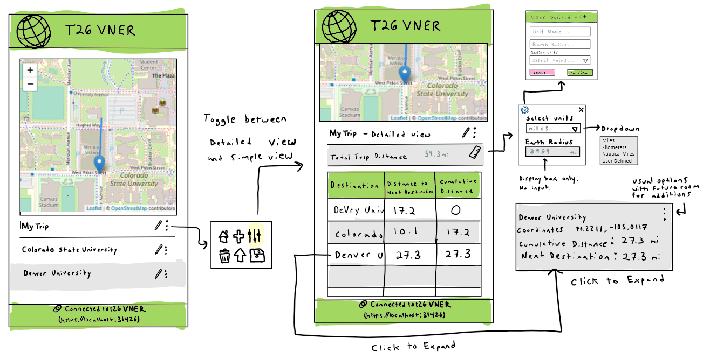

This epic requires the team to implement features to allow the user to view distances related to their trip:
* Create new "detailed view" page
* Add row under "My Trip" titled "Total Trip Distance" with an area to show the total distance variable in dark grey.
* Add Ruler button to the right side of the "Total Trip Distance" row.
* When Ruler button is clicked, open pop-up with a dropdown menu and another with a non-editable grey text box.
* Title dropdown menu "Select Units" and add the options: Miles, Kilometers, Nautical Miles, and User Defined.
* Add non-editable textbox titled "Earth Radius" that displays the radius (int) and the unit abreviation on the right.
* Add a gear icon for the settings button in the top left corner.
* Add a red "x" button in the top right corner to close window.
* Add pop-up that opens when settings symbol is selected.
* Add Green Header to pop-up window titled "User Defined Input"
* Add 2 user input text boxes saying "Unit Name..." and "Earth Radius..."
* Add dropdown menu titled "Radius Units" that has "Miles, Kilometers, Nautical Miles".
* Add cancel and confirm buttons.
* Replace itinerary with a 3 column table with sections: destination, distance to next destination, and cumulative distance.

#### Client Components
Client components will be changed and added in this epic. We will be adding a toggle-able "detailed view" page, many additional buttons with new functions to the UI inside the existing hamburger menu, functionality to rename the trip with a button, and popup capabilities to different buttons. Most of these changes will happen within the actions.js file.

#### Server Classes
We will add a functionality to the server which will calculate and update the distance between legs and the cumulative distance of the trip.
In addition, we will add support for varying distance units to be used in the server-side calculations of distances. 

# Sprint 3

In this sprint we focus on three epics. If we finish these we wil attempt other epics.

### Epic: Load Trip (finishing final touches)

#### User Interface
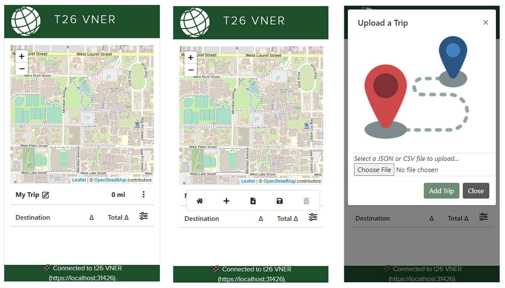

This epic requires the team to implement features to allow the user to load a previously saved map into the application:
* ~~Add a symbol for upload in the hamburger menu.~~
* ~~When symbol is clicked, generate a pop-up window to process the upload.~~
* ~~Title the pop-up window "File Upload" or something similiar.~~
* ~~Add upload button with text nearby stating filetype requirements~~
* ~~Make uplaod button open a browse system window.~~
* ~~Read in JSON file and generate the trip (The file format must be compatible with the file specification so trips from other applications may be loaded.)~~
* Read 'Earth Radius' and 'Units' from JSON and set the client earth radius and units accordingly.
* Remove mention of CSV in uploader.
* Remove File Preview feature.

  
#### Client Components 
~~Client components will be added or altered in this epic. We will be adding buttons to the user interface in the actions.js file as well as adding new functionality to the client in order to provide the user the capability to load a trip. We have added a new class called LoadTrip.js into the client>src>components>Itinerary folder.~~
All client components for this epic have been completed in sprint 2. Only functionality adjustments remain.

#### Server Classes
There are no changes to the server class structure for this epic.

### Epic: Save Trip

#### User Interface
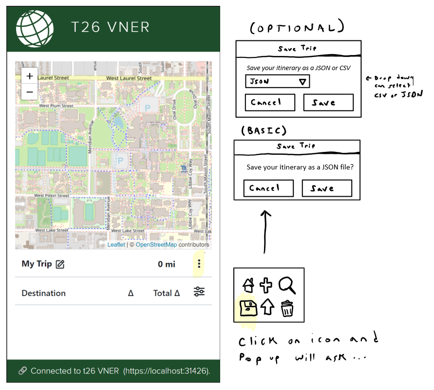

This epic requires our team to implement the ability for the user to save their trip.
* ~~Add a save button~~
* Add functionality to save button
* Save itinerary as a JSON format so the user can load their trip into this or other applications
* (Optional) Save in CSV format so the user can display in a spreadsheet or similar tool
* (Optional) Allow the user to choose the default format they prefer and the system should remember the format for future sessions. 

#### Client Components
Client components will be added or altered in this epic. We will added a new class called SaveTrip.js into the client>src>components>Itinerary folder. This will create a modal and we will be adding buttons and functions to the client-side service which will allow users to generate files to save to their local machines. We will also be adding (optionally) the ability for the client to remember previous choice preferences between sessions. 

Changes required include:
* ~~Add a save button~~
* Add a pop-up that opens when the user presses the save icon
* (Optional) Add choice between JSON and CSV
* Add Save and Close buttons

#### Server Classes
This epic will not require server side changes.

### Epic: Find Places Basic Client 

#### User Interface
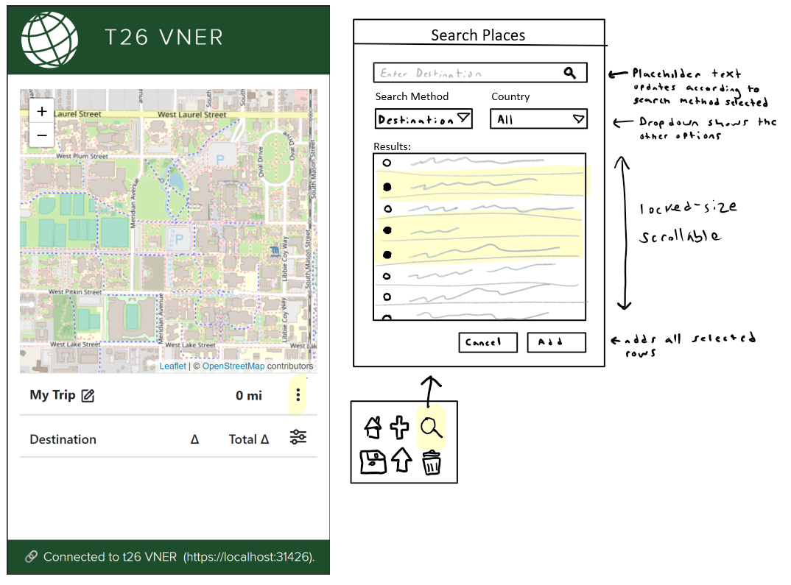

This epic requires the team to implement features to allow the user to search for places in the client:
* Add magnifying glass button to trip dropdown menu for "Find Places" feature
* Add modal popup that toggles on button click
* Create functional component that lists places inside modal, and has checkbox in each row
* On entering search string, send find request to server

#### Client Components
We are adding a functional component called SearchPlaces.js, which will render a modal that is displayed when the Find Places button is pressed. <SearchPlaces/> will be called inside of Itinerary.js, similarly to how <LoadTrip/> and <SetUnits/> are called. A hook called useFind.js will also be created to store state and pass functions into different client components.

#### Server Classes
There are no changes to the server classes in this epic.

### Epic: Find Places Basic Server

#### User Interface

This epic requires the team to implement features that allow for the user to find places to visit that match a simple string to add to their trip:
* Add Places basic endpoint to server.
* Add "find" to list of supported features.
* Add "find" schemas.
* Create a FindRequest.java class to build response.
* Create a FindInDatabase.java class to query the database and return places.

#### Client Components
There are no changes to client components in this epic.

#### Server Classes
A server class called FindRequest.java will be added to build the response. It will match the find request JSON schema. Additionally, a FindInDatabase.java class will be added to send queries to the database. FindRequest.java will call FindInDatabase.java to populate its list of places. MicroServer.java will be updated to recognize the find API endpoint. The find request and response schemas will also be added to the codebase.

### Epic: Find Places by Type Server

#### User Interface

This epic requires the team to implement features that allow for the user to find places by searching for types of places:
* Add functionality to filter results by type if it's included in the request.

#### Client Components
No client side changes will occur in this epic.

#### Server Classes
No server side changes will occur. Only functionality additions will occur to FindRequest.java and FindInDatabases.java. We will add a function that will return database results based on type.

### Epic: Find Places by Type Client

#### User Interface

This epic requires the team to implement features that allow for the user to search for places by specific type in the client:
* Add a search method dropdown to search popup.
* Send user-inputted string as "type" field in find request to server.

#### Client Components
No additional components will be created in this epic. Functionality changes will be implemented into SearchPlaces.js, which will render a modal that is displayed when the Find Places button is pressed. <SearchPlaces/> will be called inside of Itinerary.js, similarly to how <LoadTrip/> and <SetUnits/> are called. A hook called useFind.js will also be created to store state and pass functions into different client components. If the user chooses the search by type dropdown the queries will change.

#### Server Classes
No server changes will occur in this epic.

### Epic: Find Places by Country Server

#### User Interface

This epic requires the team to implement features that allow for the user to search for places by searching in a specific country:
* Add functionality to filter results by country if it is included in the request. 

#### Client Components
No client changes will occur in this epic.

#### Server Classes
No server side changes will occur. Only functionality additions will occur to FindRequest.java and FindInDatabases.java. We will add functions that respond with information from the database based on the requested country query.

### Epic: Find Places by Country Client 

#### User Interface

This epic requires the team to implement features that allow for the user to search for places by specific country in the client:
* Add a dropdown that lists each country to search popup.
* Send selected country in dropdown as "where" field in find request to the server.

#### Client Components
We are adding a functional component called SearchPlaces.js, which will render a modal that is displayed when the Find Places button is pressed. <SearchPlaces/> will be called inside of Itinerary.js, similarly to how <LoadTrip/> and <SetUnits/> are called. A hook called useFind.js will also be created to store state and pass functions into different client components. We will add the country option to the dropdown menu in the SeachPlaces.js Modal.

#### Server Classes

### Epic: Find Places Random

#### User Interface

This epic requires the team to implement features that allow for the user would like to add random places to their trip:
* Add functionality to return a random place or list of places when "match" is == "" in find request to server.

#### Client Components
There are no changes to client components in this epic.

#### Server Classes
The server class FindInDatabase.java has to be modified to return a random place if the requested match pattern is an empty string.

# Sprint 4 

Component Hierarchy
The component hierarchy for the base application depicted below shows the our top level App component with four children components.

App renders the major components on the screen.
Header renders an icon and a team name in the top banner.
Footer renders the current server connection in the bottom footer.
Planner renders a map.
About renders information about the team.
LoadTrip renders upload modal
SetUnits renders modal to allow user to set units
EditName renders modal to edit trip name
AddPlace renders modal to allow for user to search for and add places to map
base component hierarchy 

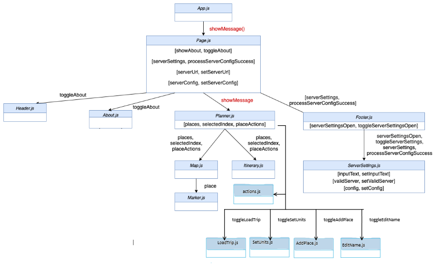

###Sprint 4 Planned Epics

In this sprint we focus on 7 epics.

### Epic: Find Places Basic Client 

#### User Interface
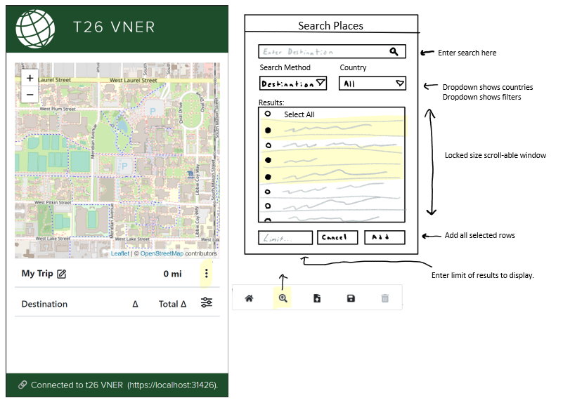

This epic requires the team to implement features to allow the user to search for places in the client:
* Add modal popup that toggles on button click
* Create functional component that lists places inside modal, and has checkbox in each row
* On entering search string, send find request to server
* Have two filters - country and type
* Allow user to enter a limit for the number of results

### Epic: Shorter Trip

#### User Interface
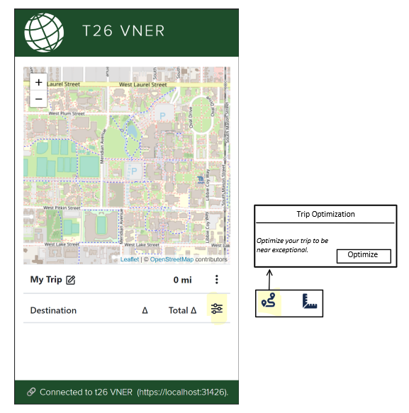
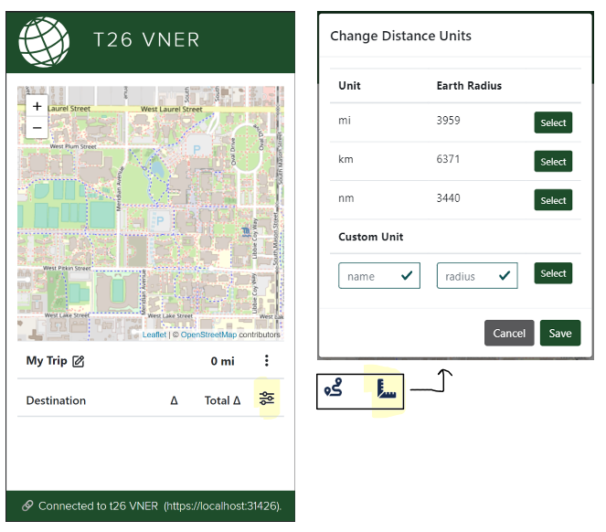

This epic requires the team to optimize the route to minimize round trip distance
* Implement Nearest Neighbor method for longest lists
* Implement 2 opt for shorter lists
* Implement 3 opt for shortest lists
* All optimizations should take 1 second or less
* Add optimize icon in settings menu that opens optimization modal

### Epic: Find Places by Type Server

#### User Interface

This epic requires the team to implement features that allow for the user to find places by searching for types of places:
* Add functionality to filter results by type if it's included in the request.

#### Client Components
No client side changes will occur in this epic.

#### Server Classes
No server side changes will occur. Only functionality additions will occur to FindRequest.java and FindInDatabases.java. We will add a function that will return database results based on type.

### Epic: Find Places by Type Client

#### User Interface

This epic requires the team to implement features that allow for the user to search for places by specific type in the client:
* Add a search method dropdown to search popup.
* Send user-inputted string as "type" field in find request to server.

#### Client Components
No additional components will be created in this epic. Functionality changes will be implemented into SearchPlaces.js, which will render a modal that is displayed when the Find Places button is pressed. <SearchPlaces/> will be called inside of Itinerary.js, similarly to how <LoadTrip/> and <SetUnits/> are called. A hook called useFind.js will also be created to store state and pass functions into different client components. If the user chooses the search by type dropdown the queries will change.

#### Server Classes
No server changes will occur in this epic.

### Epic: Find Places by Country Server

#### User Interface

This epic requires the team to implement features that allow for the user to search for places by searching in a specific country:
* Add functionality to filter results by country if it is included in the request. 

#### Client Components
No client changes will occur in this epic.

#### Server Classes
No server side changes will occur. Only functionality additions will occur to FindRequest.java and FindInDatabases.java. We will add functions that respond with information from the database based on the requested country query.

### Epic: Find Places by Country Client 

#### User Interface

This epic requires the team to implement features that allow for the user to search for places by specific country in the client:
* Add a dropdown that lists each country to search popup.
* Send selected country in dropdown as "where" field in find request to the server.

#### Client Components
We are adding a functional component called SearchPlaces.js, which will render a modal that is displayed when the Find Places button is pressed. <SearchPlaces/> will be called inside of Itinerary.js, similarly to how <LoadTrip/> and <SetUnits/> are called. A hook called useFind.js will also be created to store state and pass functions into different client components. We will add the country option to the dropdown menu in the SeachPlaces.js Modal.

#### Server Classes

### Epic: Find Places Random

#### User Interface

This epic requires the team to implement features that allow for the user would like to add random places to their trip:
* Add functionality to return a random place or list of places when "match" is == "" in find request to server.

#### Client Components
There are no changes to client components in this epic.

#### Server Classes
The server class FindInDatabase.java has to be modified to return a random place if the requested match pattern is an empty string.

# Sprint 5

Component Hierarchy
The component hierarchy for the base application depicted below shows the our top level App component with four children components.

App renders the major components on the screen.
Header renders an icon and a team name in the top banner.
Footer renders the current server connection in the bottom footer.
Planner renders a map.
About renders information about the team.
LoadTrip renders upload modal
SetUnits renders modal to allow user to set units
EditName renders modal to edit trip name
AddPlace renders modal to allow for user to search for and add places to map
OptTrip renders modal to allow for trip optimization
SaveTrip renders modal to allow user to save trip as a JSON
base component hierarchy 

  ### Class Diagram
The class diagram for the base application depicted below shows the basic structure of the web server application.

The classes in blue represent the classes specific to this application.  
* WebApplication processes command line parameters and creates MicroServer.
* MicroServer start a web server on the given port, configures the server for security, static files, and APIs for different types of requests, and processes the requests as they arrive.
* JSONValidator verifies a request is properly formatted before attempting to process it using JSON Schemas.
* ConfigRequest is a specific request that allows the server to respond with its configuration to allow interoperability between clients and servers. 
* Request defines the basic components of all requests.
* BadReqeustException allows us to distinguish bad requests from other types of exceptions that may occur.
* TourRequest allows us to send a request to optimize the current trip
* DistancesRequest allows us to calcualate distances between places
* FindRequest allows us to request a search request from the database
* GreatCircleDistance lets us calucalte the distances based on earth radius
* OptimizeTrip handles the calculations needed to optimize the trip in the TourRequest
* SQLGuide allows us to query the database for FindRequest
  * Database is a subclass of SQLGuide that returns query results
  * Credential is a subclass of SQLGuide that lets us access the database
  * Select is a sublclass of SQLGuide that lets us call the SELECT command
* Place is a class that extends HashMap<String, String> to let us create a Place object
* Places is a class that extends ArrayList<Place> to let us create an arrayList of Place object

  
These test classes provide automated tests for unit testing.
* TestWebApplication
* TestMicroServer
* TestConfigRequest
* TestJSONValidator
* TestGreatCircleDistance
* TestOptimizeTrip
* TestFindRequest
* TestSQLGuide
* TestTourRequest
* TestDistancesRequest
###Sprint 5 Planned Epics

In this sprint we focus on 6 epics.

### Epic: Find Places Type Server

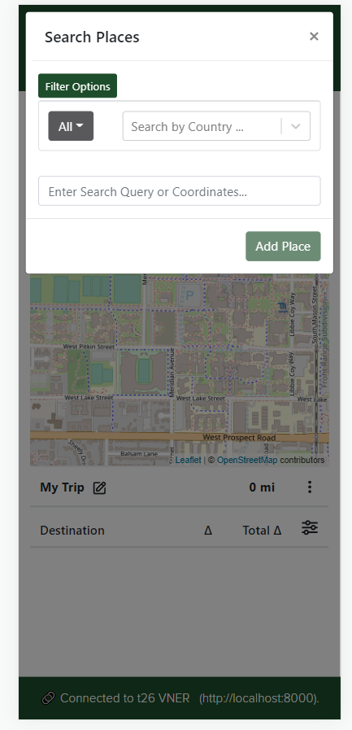

Server side functionality for searching places by type.
The user would like to receive a list of places of a specific type. The server should query the database for places only of that type, and return the results in an http response to the client in JSON format.

### Epic: Find Places Country Server

#### User Interface

Server side functionality for searching places by country.
The user would like to receive a list of places filtered by country. The server should respect this request and only query the database for places that are located in that country when asked.

### Epic: Find Places Random

#### User Interface
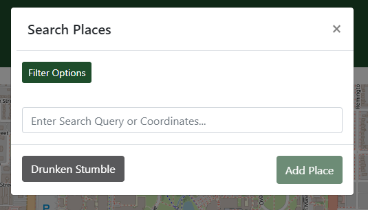

Implement ability to add random places to the trip.
The user would like to find random places to add to their trip. When the user searches for trips with an empty search string, random places should be returned instead. Any other specifications such as country of origin should still be respected.

### Epic: Save Trip

#### User Interface

The user would like to be able to save their trip.
The user would like to save in JSON format 

### Epic: Increase Test Coverage

#### Current Coverage

The team will work to increase test coverage of client-side code in order to raise test coverage as high as possible before the final release.

### Epic: UX Improvements

The team has performed UX experiments and wants to work on implememting better user interface designs to increase user experience with the application.
